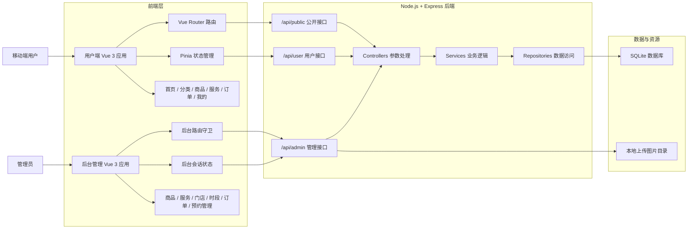
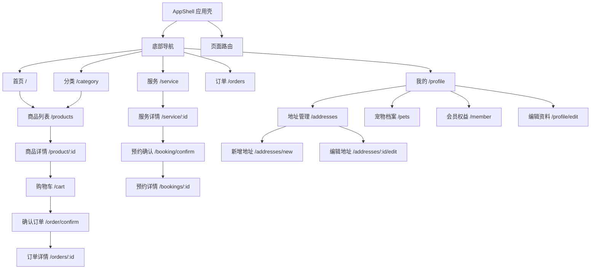
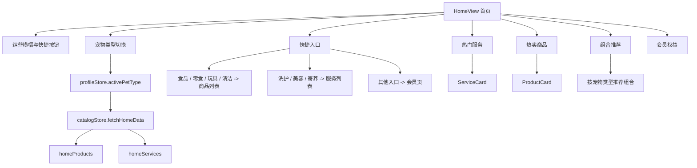
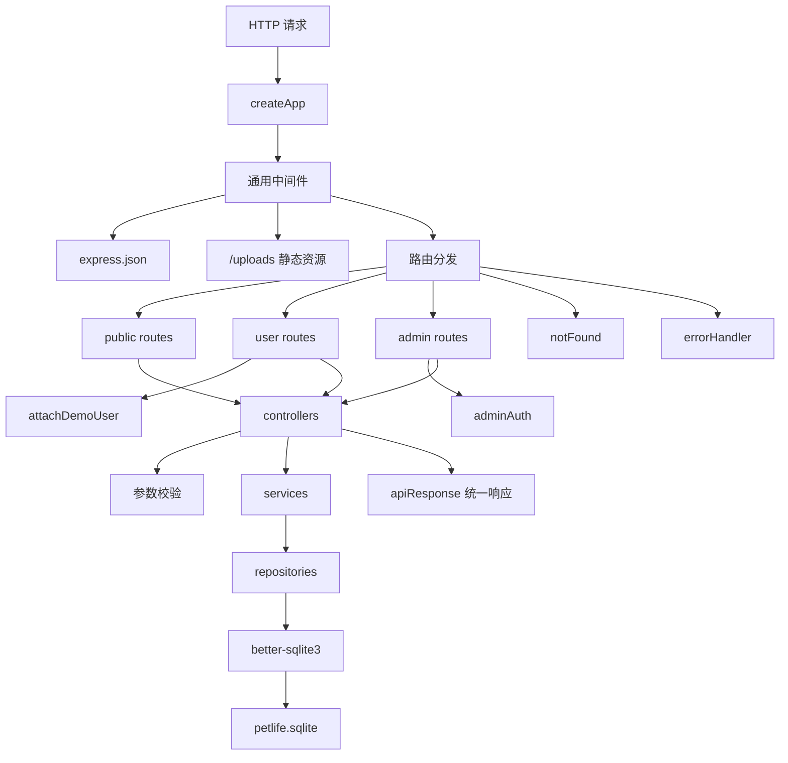
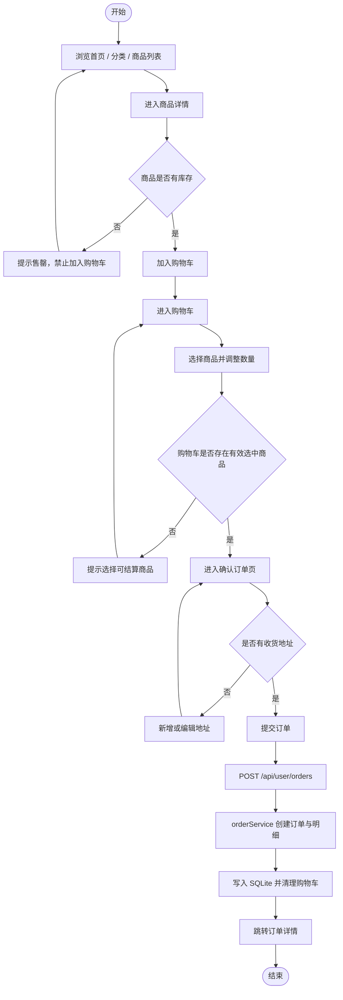
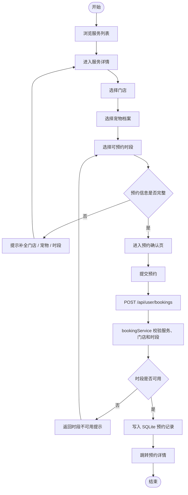

# PetLife Mermaid 图表源码

## 1. 项目整体架构图

```mermaid
flowchart LR
  user["移动端用户"] --> client["用户端 Vue 3 应用"]
  adminUser["管理员"] --> admin["后台管理 Vue 3 应用"]

  subgraph frontend["前端层"]
    client --> clientRouter["Vue Router 路由"]
    client --> clientStore["Pinia 状态管理"]
    client --> clientViews["首页 / 分类 / 商品 / 服务 / 订单 / 我的"]
    admin --> adminRouter["后台路由守卫"]
    admin --> adminStore["后台会话状态"]
    admin --> adminViews["商品 / 服务 / 门店 / 时段 / 订单 / 预约管理"]
  end

  subgraph backend["Node.js + Express 后端"]
    publicApi["/api/public 公开接口"]
    userApi["/api/user 用户接口"]
    adminApi["/api/admin 管理接口"]
    controllers["Controllers 参数处理"]
    services["Services 业务逻辑"]
    repositories["Repositories 数据访问"]
  end

  subgraph storage["数据与资源"]
    sqlite["SQLite 数据库"]
    uploads["本地上传图片目录"]
  end

  clientRouter --> publicApi
  clientStore --> userApi
  adminRouter --> adminApi
  adminStore --> adminApi
  publicApi --> controllers
  userApi --> controllers
  adminApi --> controllers
  controllers --> services
  services --> repositories
  repositories --> sqlite
  adminApi --> uploads
```

## 2. 用户端页面结构图

```mermaid
flowchart TD
  app["AppShell 应用壳"] --> tabs["底部导航"]
  app --> pages["页面路由"]

  tabs --> home["首页 /"]
  tabs --> category["分类 /category"]
  tabs --> service["服务 /service"]
  tabs --> orders["订单 /orders"]
  tabs --> profile["我的 /profile"]

  home --> products["商品列表 /products"]
  category --> products
  products --> productDetail["商品详情 /product/:id"]
  productDetail --> cart["购物车 /cart"]
  cart --> orderConfirm["确认订单 /order/confirm"]
  orderConfirm --> orderDetail["订单详情 /orders/:id"]

  service --> serviceDetail["服务详情 /service/:id"]
  serviceDetail --> bookingConfirm["预约确认 /booking/confirm"]
  bookingConfirm --> bookingDetail["预约详情 /bookings/:id"]

  profile --> addresses["地址管理 /addresses"]
  addresses --> addressNew["新增地址 /addresses/new"]
  addresses --> addressEdit["编辑地址 /addresses/:id/edit"]
  profile --> pets["宠物档案 /pets"]
  profile --> member["会员权益 /member"]
  profile --> profileEdit["编辑资料 /profile/edit"]
```

## 3. 首页功能模块结构图

```mermaid
flowchart TD
  home["HomeView 首页"] --> hero["运营横幅与快捷按钮"]
  home --> petSwitch["宠物类型切换"]
  home --> quickEntries["快捷入口"]
  home --> services["热门服务"]
  home --> bundles["组合推荐"]
  home --> products["热卖商品"]
  home --> member["会员权益"]

  petSwitch --> profileStore["profileStore.activePetType"]
  profileStore --> fetchHome["catalogStore.fetchHomeData"]
  fetchHome --> homeProducts["homeProducts"]
  fetchHome --> homeServices["homeServices"]

  quickEntries --> productRoute["食品 / 零食 / 玩具 / 清洁 -> 商品列表"]
  quickEntries --> serviceRoute["洗护 / 美容 / 寄养 -> 服务列表"]
  quickEntries --> memberRoute["其他入口 -> 会员页"]

  services --> serviceCard["ServiceCard"]
  products --> productCard["ProductCard"]
  bundles --> bundleFilter["按宠物类型推荐组合"]
```

## 4. 后端分层结构图

```mermaid
flowchart TD
  request["HTTP 请求"] --> app["createApp"]
  app --> middleware["通用中间件"]
  middleware --> json["express.json"]
  middleware --> staticFiles["/uploads 静态资源"]
  middleware --> routes["路由分发"]

  routes --> publicRoutes["public routes"]
  routes --> userRoutes["user routes"]
  routes --> adminRoutes["admin routes"]

  userRoutes --> demoUser["attachDemoUser"]
  adminRoutes --> adminAuth["adminAuth"]

  publicRoutes --> controllers["controllers"]
  userRoutes --> controllers
  adminRoutes --> controllers

  controllers --> validators["参数校验"]
  controllers --> services["services"]
  services --> repositories["repositories"]
  repositories --> db["better-sqlite3"]
  db --> sqlite["petlife.sqlite"]

  controllers --> response["apiResponse 统一响应"]
  routes --> notFound["notFound"]
  routes --> errorHandler["errorHandler"]
```

## 5. 商品购买流程图

```mermaid
flowchart TD
  start(["开始"]) --> browse["浏览首页 / 分类 / 商品列表"]
  browse --> detail["进入商品详情"]
  detail --> stock{"商品是否有库存"}
  stock -- "否" --> soldOut["提示售罄，禁止加入购物车"]
  soldOut --> browse
  stock -- "是" --> addCart["加入购物车"]
  addCart --> cart["进入购物车"]
  cart --> selectItems["选择商品并调整数量"]
  selectItems --> valid{"购物车是否存在有效选中商品"}
  valid -- "否" --> remind["提示选择可结算商品"]
  remind --> cart
  valid -- "是" --> confirm["进入确认订单页"]
  confirm --> address{"是否有收货地址"}
  address -- "否" --> editAddress["新增或编辑地址"]
  editAddress --> confirm
  address -- "是" --> submit["提交订单"]
  submit --> api["POST /api/user/orders"]
  api --> service["orderService 创建订单与明细"]
  service --> db["写入 SQLite 并清理购物车"]
  db --> result["跳转订单详情"]
  result --> finish(["结束"])
```

## 6. 服务预约流程图

```mermaid
flowchart TD
  start(["开始"]) --> serviceList["浏览服务列表"]
  serviceList --> serviceDetail["进入服务详情"]
  serviceDetail --> chooseStore["选择门店"]
  chooseStore --> choosePet["选择宠物档案"]
  choosePet --> chooseTime["选择可预约时段"]
  chooseTime --> complete{"预约信息是否完整"}
  complete -- "否" --> prompt["提示补全门店 / 宠物 / 时段"]
  prompt --> serviceDetail
  complete -- "是" --> confirm["进入预约确认页"]
  confirm --> submit["提交预约"]
  submit --> api["POST /api/user/bookings"]
  api --> service["bookingService 校验服务、门店和时段"]
  service --> available{"时段是否可用"}
  available -- "否" --> failed["返回时段不可用提示"]
  failed --> chooseTime
  available -- "是" --> db["写入 SQLite 预约记录"]
  db --> result["跳转预约详情"]
  result --> finish(["结束"])
```
